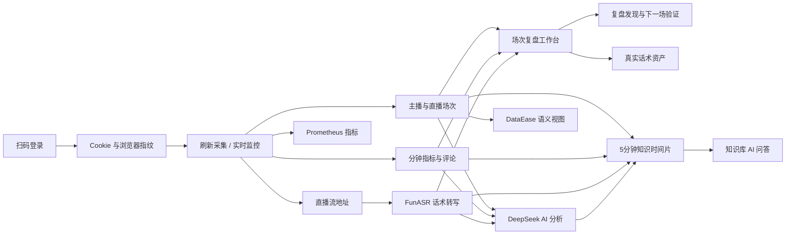

# 零食店避坑直播运营复盘系统

面向“开零食店如何避坑”知识科普直播的一体化运营中台：通过选址、预算、品牌、供应链、毛利损耗和证照等内容帮助准备开店的用户，再用选址检查表、预算测算表、品牌尽调清单等真实资料作为钩子，引导用户主动在抖音站内私信。系统使用已扫码登录的采集账号同步主播、直播场次、分钟指标和用户评论；使用受控的 FunASR 队列生成直播话术；最后把回放、数据、评论、话术和复盘证据集中到同一个场次详情中。

> 本项目仅用于已获授权的数据分析。请遵守平台规则、隐私要求和当地法律，不要采集或传播无权处理的数据。

## 核心能力

- **扫码登录**：保存 Cookie、StorageState 和浏览器指纹，后续采集复用登录环境；连续两次探测失败才判定登录过期，减少平台临时跳转误报。
- **刷新数据采集**：增量补齐全部主播、历史直播场次、场次指标、评论、观众画像和流地址。
- **实时直播监控**：定时识别开播状态，直播中持续采集指标和评论，下播后补齐场次详情。
- **采集日志工作台**：日志列表固定高度并在区域内滚动，横向滚动时保留右侧“查看”操作；支持筛选、静默刷新和二次确认清空，清空只删除现有采集日志，不影响任务、账号、主播或直播场次，运行中任务产生的新日志仍会继续写入。
- **场次列表性能**：直播场次页使用数据库分页、轻量字段响应和“开播时间 + 场次 ID”联合索引，默认首屏只读取 10 行；主播头像优先显示真实采集图片，仅在图片加载失败时回退为姓名首字，详情、评论、回放和 AI 数据仅在进入详情后读取。
- **可靠任务**：采集与 ASR 任务保存幂等键、Trace ID、Worker、心跳和重试次数，生命周期事件写入可回放的 Redis Streams。
- **自动分析流水线**：采集后持续为全部可用真实回放补充队列，默认从开播时间最新的场次开始转写；单场转写完成后依次执行话术评分、结构化 AI 复盘、知识库增量同步和 DataEase 同步；每个阶段幂等并保存结果，Worker 重启后可继续处理历史积压。
- **长场次可靠性**：完整话术和知识库内容均使用 MySQL `LONGTEXT` 保存；手动重试会保留已完成分片并重置失败部分，Worker 数据库异常会先回滚再记录状态，避免一小时以上直播在合并全文或知识入库时被误判失败。
- **话术工作台**：默认打开最新真实直播场次，自动队列、各主播增量任务和 Worker 执行也按真实开播时间从新到旧处理（人工设置的高优先级任务仍可插队）；场次选择器展示真实主播头像并支持搜索，集中展示完整分段、全文、时间覆盖、AI 评分、内容分类和时间导航；任务状态卡可穿透查看主播、场次、失败原因、重试次数与已有分段，活跃任务每 5 秒静默刷新；未生成全文的场次使用正常空状态，不再误报 404。
- **低资源保护**：ASR 同时只转写 1 场，自动回收心跳超时任务并从已完成分片续跑；默认关闭逐条 SQL 回显和 WebSocket 音频帧日志，避免长场次日志占满磁盘；实时监控的浏览器页面任务同样串行，避免多主播同时采集时关闭共享上下文。
- **无头浏览器稳定性**：Playwright Chromium 使用新版无头模式，关闭硬件 GPU 与 WebGL 但保留软件光栅器作为 macOS 渲染后备；登录上下文保留一个无网络空白页，避免零页面时浏览器退出，异常后仍会从保存的 Cookie、StorageState 和指纹自动恢复。
- **视频下载**：场次详情显示 m3u8 地址，可选择本地位置并以原码流低开销封装为 MP4。
- **兼容回放**：抖音回放为 H.265 时，场次详情使用靠左的小尺寸 9:16 竖屏播放器按需转换为浏览器兼容的 H.264；统一复盘时间轴在播放器右侧，分钟指标曲线保持在下方；macOS 优先使用硬件编码，单路限速运行且离开页面立即释放。
- **AI 复盘工作台**：默认打开最新真实直播场次，场次选择器展示真实主播头像并支持搜索，统一展示数据可信度、五维话术评分、优势不足、证据发现、下一场动作和历史报告；完整复盘按证据提取、AI 评分、优化建议分阶段执行。
- **证据化复盘工作台**：回放、分钟趋势、评论、话术和复盘发现使用同一条时间轴，点击证据可跳转到对应回放位置。
- **场次详情精简**：详情页只保留一份分钟曲线，复盘发现直接维护确认状态；场次信息与回放下载合并展示，评论、画像和 AI 按需切换，跨场选择只读取最近 100 条轻量场次。
- **P1 复盘能力**：同主播跨场对比、实时异常提示、下一场验证、真实话术资产和版本化合规筛查。
- **零食店领域分析**：识别城市选址、预算面积、租金转让费、品牌加盟、货源供应链、毛利损耗、证照和资料领取问题；禁止把业务误判为零食带货。
- **知识库自由问答**：话术、评论和分钟指标按 5 分钟形成可追溯时间片；聊天主工作区支持连续追问、分类检索和真实来源展开，追问会继承上一轮引用场次，引用可直接穿透到原直播场次。
- **主播排班核对**：从真实 `排班.xls` 导入 17 个每日班次，文豪、大全各 4 场，其余排班主播各 3 场；每场按 80 分钟与真实采集场次一对一匹配，已结束且不足 45 分钟标记无效，已到期后提示缺场、时长不足和跨整点开播，未来班次不提前误报。
- **指标语义层**：统一 16 项核心指标定义，并通过 10 个 `de_v_*` 只读事实/维度视图供 DataEase 使用。
- **可观测性**：全请求 Trace ID、JSON 结构化日志、Prometheus `/metrics` 和低资源 Grafana 可选监控。

## 数据链路



## 技术栈

- 前端：Vue 3、TypeScript、Vite、SoybeanAdmin、Naive UI、ECharts
- 后端：FastAPI、SQLAlchemy、APScheduler、Playwright
- 数据：MySQL 8、Redis 7
- AI：DeepSeek API、FunASR、ffmpeg
- 可视化：DataEase（可选）
- 可观测性：Prometheus、Grafana（可选 profile）

## 环境要求

- macOS 或 Linux
- Docker Desktop
- Python 3.10
- Node.js 20+ 与 pnpm
- ffmpeg

macOS 可检查依赖：

```bash
docker --version
python3 --version
node --version
pnpm --version
ffmpeg -version
```

## 首次安装

1. 创建本地配置，填写自己的 DeepSeek 密钥：

```bash
cp .env.example .env
```

2. 安装后端依赖和 Playwright Chromium：

```bash
cd backend
python3 -m venv .venv
source .venv/bin/activate
pip install -r requirements.txt
playwright install chromium
cd ..
```

3. 安装前端依赖：

```bash
cd frontend
pnpm install
cd ..
```

4. 一键启动：

```bash
./start.sh
```

启动后访问：

- 前端：<http://localhost:9527>
- 后端健康检查：<http://localhost:8000/health>
- API 文档：<http://localhost:8000/docs>
- DataEase（可选）：<http://localhost:8100>
- Prometheus（可选）：<http://localhost:9090>
- Grafana（可选）：<http://localhost:3000>

`start.sh` 启动 MySQL、Redis、执行 Alembic 数据库迁移、配置 DataEase 只读账号、启动后端和前端，后端会自动启动 FunASR。后端默认使用稳定单进程模式，避免开发热更新遗留孤儿进程和重复数据库连接；需要修改后端代码并自动重载时可使用 `BACKEND_RELOAD=true ./start.sh`。采集调度器由后端统一管理，不再额外启动第二个采集 Worker；FunASR 限制 2 核、1.8GB 内存，ffmpeg 单线程，ASR Worker 单任务并发且最多排队 5 场。

DataEase 应使用 `.env` 中的 `DATAEASE_READER_USER` 和 `DATAEASE_READER_PASSWORD` 连接业务 MySQL。该账号只有 `SELECT`、`SHOW VIEW` 权限，不能修改业务数据。现有大屏继续使用 `de_*` 宽表，新数据集优先使用 `de_v_*` 语义视图；统一指标接口为 `GET /api/v1/dataease/semantic-layer`，同步状态接口为 `GET /api/v1/dataease/status`。

复盘新增只读事实视图：

| 视图 | 粒度 | 用途 |
| --- | --- | --- |
| `de_v_fact_review_finding` | 每条复盘发现一行 | 风险、机会、证据时间点和处理状态 |
| `de_v_fact_review_action` | 每个整改任务一行 | 负责人、进度、截止时间和验证场次 |
| `de_v_fact_script_asset` | 每个真实话术资产一行 | 分类、来源原文、时间点和人工确认状态 |

## 推荐操作顺序

第一次使用建议先阅读图文教程：[新手使用教程](docs/beginner-guide.md)。教程包含当前真实页面截图、每一步成功标准和常见故障处理。

1. 打开“数据采集”页面，扫码登录采集账号。
2. 确认账号状态为“已登录”，并使用“检查存活”验证 Cookie。
3. 可直接执行“刷新数据采集”；刷新期间实时监控会保持开启但暂缓浏览器任务，刷新完成后自动恢复。
4. 等待采集进度完成，查看已同步主播数、场次数、详情数和失败原因；采集日志在固定区域内滚动，“查看”操作始终固定在右侧。清空日志必须二次确认，并且不会删除任务和业务数据。
5. 在“直播场次”进入详情，先确认复盘数据可信度，再联动查看回放、分钟趋势、按用户归组的评论和话术证据。
6. ASR 默认自动生成话术；电脑负载较高时，可在采集页关闭 ASR 释放模型内存。
7. 在“AI 复盘”选择已有真实报告的场次，先检查数据可信度，再生成完整复盘和下一场可验证动作。
8. 在详情的“跨场对比”选择真实基准场次，核对已确认的复盘发现，并在下一场验证。
9. 从时间轴收录表现明确的真实话术片段，人工确认后再进入话术资产库。
10. 在“知识库”点击“同步最近 20 场”，确认话术、评论和指标时间片数量，再使用问答输入业务问题。
11. 在“主播排班”按日期核对计划与真实场次，点击提醒查看缺场、无效场次、时长不足或跨整点明细，并可穿透到场次详情。

## 主播排班

“主播排班”是知识库下方的一级页面，排班模板保存在 MySQL `anchor_schedules`，DataEase 可通过只读视图 `de_v_fact_anchor_schedule` 使用。当前模板来源为 `排班.xls`：

- 韩龙飞（飞哥）、民哥、丹丹（丹姐）每天各 3 场。
- 刘文豪（文豪）、王路权（大全）每天各 4 场。
- 每场标准时长为 80 分钟，计划开播和下播时间保持源表原值。
- 实际场次按照主播别名和计划时间在两小时窗口内一对一匹配，同一场直播不会重复占用多个班次。
- 计划时间后的下一个整点已过仍未开播才提示缺场；实际开播须在计划时间所在自然小时内，提前或延后跨出该小时均提示“跨整点开播”。
- 已结束场次不足 45 分钟标记为“无效场次”；达到 45 分钟但不足 80 分钟标记为“时长不足”；正在直播的场次无论当前时长多少都不会提前判为无效。
- 页面支持选择起止日期和“近 7 天”快捷查询，单次最多连续 31 天；范围内按日期汇总场次、主播完成度和提醒，未来班次不会提前产生缺场提醒。
- 主播完成度卡片直接显示缺场和无效场次的日期及当天数量；日期较多时保留摘要，悬停可查看缺少的场次序号，或无效场次的真实开播时间和精确时长。
- 同一主播当天真实开播数超过规定场次数量时，超出的真实场次标记为“加场”；主播完成度卡片按日期显示加场数，悬停可查看具体开播时间。加场不足 45 分钟时显示为“无效加场”，同时计入加场和无效统计。
- 查询范围包含当天时每 60 秒静默刷新；纯历史范围按需刷新，避免无意义轮询。

主要接口：

```text
GET /api/v1/anchor-schedules/dashboard?start_date=2026-07-10&end_date=2026-07-16
```

原单日参数 `schedule_date=2026-07-16` 继续兼容。

## 场次详情与 AI 复盘

“AI 复盘”负责场次选择、历史报告恢复、评分总览和下一场动作；直播场次详情负责回放、分钟曲线、评论、话术和原始证据，两者通过场次 ID 联动：

- **可信度**：基础信息、分钟指标、评论映射、ASR、回放、画像和 AI 报告分别计算覆盖率；低完整度场次允许回看，但不会伪装成稳定结论。
- **统一时间轴**：真实指标、评论、话术和复盘发现按开播后的相对秒数对齐；缺少平台时间的评论不会猜测归属。
- **证据化发现**：在线骤降、开店筹备问题、资料钩子、站内私信承接和合规关键词都保留原始证据、时间点、置信度与处理状态。
- **跨场对比**：默认对比同主播上一场，也可选择其他真实场次；曲线按开播后分钟对齐，完整度和时长差异会明确提示。
- **发现状态**：复盘发现可直接标记为已确认、已解决或忽略，详情页不再维护额外的整改任务流程；历史整改记录继续保留在数据库中。
- **话术资产**：只能从真实 ASR 片段收录，保留来源场次、时间点、原文、效果说明和人工确认状态。
- **合规筛查**：规则来自公开平台规范，只作为人工复核提醒，不替代平台审核或法律判断；系统禁止生成虚假稀缺、保证收益、夸大食品功效和站外导流建议。

主要接口：

```text
GET   /api/v1/reviews/{session_id}/workbench
POST  /api/v1/reviews/{session_id}/generate
GET   /api/v1/reviews/{session_id}/comparison
PATCH /api/v1/reviews/{session_id}/findings/{finding_id}
POST  /api/v1/reviews/{session_id}/script-assets
PATCH /api/v1/reviews/{session_id}/script-assets/{asset_id}
GET   /api/v1/reviews/compliance/rules
```

合规规则参考[抖音电商食品宣传治理](https://school.jinritemai.com/doudian/wap/article/aJkzdMC7vUSV)与[抖音开放平台企业号线索授权说明](https://open.douyin.com/platform/resource/docs/ability/enterprise-account-open-ability/enterprise-user-solution/)。站内私信与线索数据只在账号已授权且页面真实返回时保存。

## 前端交互规范

- 业务页面沿用 SoybeanAdmin 的 Vue 3、TypeScript、Pinia、Naive UI、UnoCSS 与 Elegant Router 结构。
- 依赖安装和脚本统一使用 `pnpm`，提交前执行类型检查、ESLint 和生产构建。
- 每个业务页统一展示用途、真实数据状态、前置条件和下一步操作；右上角“新手帮助”会根据当前路由给出操作顺序。
- 列表页区分真实零值与未采集值，长表格使用固定关键列、内部滚动和响应式分页。
- 异步操作必须展示加载、成功结果或可恢复的失败原因，危险操作必须二次确认。
- 数据大屏的主播数量按唯一抖音号去重，避免同一主播修改昵称后被重复计数。

## ASR 安全说明

FunASR 首次启动会下载并加载模型，可能需要数分钟。项目为 8GB 内存电脑设置了容器资源限制、低优先级 Worker、单任务并发和 5 个任务队列上限：

- 自动队列默认按真实开播时间从新到旧处理，人工高优先级任务可插队；正在直播的无限流不会进入离线转写，每完成一场会自动补充下一场，不受最初 5 个队列容量限制。
- 真实回放默认按 300 秒分片；Worker 重启只重试未完成分片，不删除已经完成的话术。
- 话术完成后，AI 复盘和知识库后处理保持单并发；失败原因、重试次数和处理结果保存在 `asr_tasks`，并同步显示在采集日志与主播话术任务明细中。
- 无语音或失效回放失败后不会自动反复重试。
- 页面显示“处理中 0”后再关闭 ASR，关闭会释放模型内存。
- “未识别到有效语音”通常表示回放没有人声、流已过期或音频过短，不会写入模拟话术。
- 缺少真实 m3u8 时任务会明确失败，不会使用模拟流地址兜底。

任务生命周期同时写入 Redis Stream `douyin:task-events`。Redis 短暂不可用不会阻断真实采集，最终任务状态以 MySQL 为准。

手动启停 FunASR（一般直接使用页面开关即可）：

```bash
docker compose --profile funasr up -d funasr
docker stop douyin_live_funasr
```

## 知识库内容

每个场次可幂等同步以下来源：

| 来源 | `source_type` | 内容 |
| --- | --- | --- |
| 直播数据 | `live_data` | 汇总指标、转化率、分钟趋势、观众画像 |
| 互动评论 | `comments` | 评论时间、昵称、内容和高意向标记 |
| 话术 | `transcript` | FunASR 识别后的完整话术 |
| AI 分析 | `ai_analysis` | 话术评分，以及包含真实证据、时间点、问题和建议的结构化复盘 |

知识库同步是增量且幂等的：再次同步会更新同一场次内容，不会重复生成直播数据或评论条目。

知识库页面以自由问答为主、证据核验为辅。聊天卡片位于页面首屏，输入框固定在卡片底部，长回答只在消息区域内部滚动；问答接口最多接收最近 8 条历史消息，省略式追问会继承上一轮问题和已引用场次。模型只能依据本次召回的话术、评论、分钟指标和整场知识作答，证据不足时返回无结果，不生成模拟业务数据。

```text
POST /api/v1/ai/qa
body: { question, category?, history: [{ role, content }] }
```

### 5 分钟时间片

`knowledge_time_slices` 使用直播平台时间把以下真实数据绑定到同一区间：

- FunASR 话术使用相对开播秒数归属。
- 评论必须同时具备评论平台时间和场次开播时间才会归属；无法确定的评论只增加“未映射评论”计数，不猜测时间片。
- 分钟指标使用 `metric_time` 归属，并保留采样数、平均在线、峰值在线及首末值变化。
- 重复同步使用源数据哈希更新原时间片，不重复插入。

主要接口：

```text
GET  /api/v1/knowledge-base/time-slices/status
GET  /api/v1/knowledge-base/time-slices
GET  /api/v1/knowledge-base/time-slices/search?query=...
POST /api/v1/knowledge-base/time-slices/sync/{session_id}
```

## 可观测性

后端按照 Prometheus Python Client 规范提供 `GET /metrics`，每个 HTTP 响应返回 `X-Trace-ID`，也可通过请求头传入合法 `X-Trace-ID` 串联外部调用。JSON 日志包含时间、级别、模块、函数、行号和 Trace ID。

默认一键启动不会启动 Prometheus 和 Grafana。需要查看监控大盘时执行：

```bash
docker compose --profile observability up -d prometheus grafana
```

资源限制为 Prometheus 0.5 核/512MB、Grafana 0.5 核/512MB。Grafana 默认地址为 <http://localhost:3000>，本地初始账号为 `admin / admin123`，首次使用后请立即修改密码。配置参考 [Prometheus Python Client 官方文档](https://prometheus.github.io/client_python/exporting/http/asgi/)、[Grafana Docker 官方文档](https://grafana.com/docs/grafana/latest/setup-grafana/installation/docker/) 和 [DataEase 数据源文档](https://dataease.io/docs/v2/user_manual/datasource_description/)。

## 常用检查

后端测试：

```bash
cd backend
source .venv/bin/activate
pytest -q
```

前端类型和构建检查：

```bash
cd frontend
pnpm typecheck
pnpm lint
pnpm build
```

服务状态：

```bash
curl http://localhost:8000/health
curl http://localhost:8000/metrics
docker compose ps
```

## 目录结构

```text
douyinLive/
├── backend/          FastAPI、采集、ASR、AI 与测试
├── frontend/         SoybeanAdmin 前端
├── data/             本地数据库、模型、日志（不提交 Git）
├── docs/             开发记录
├── observability/    Prometheus 与 Grafana 配置
├── docker-compose.yml
└── start.sh          本地一键启动脚本
```

## 数据安全

- `.env`、`data/`、`backend/storage_state/*.json` 已加入 `.gitignore`。
- Cookie、Token、浏览器指纹和 AI 密钥只能保存在本机，不得提交远程仓库。
- 默认 `ALLOW_SYNTHETIC_DATA=false`。模拟监控和模拟 ASR 必须同时开启调试模式、总开关和具体功能开关，防止误写真实数据库。
- 删除采集账号会清除本地登录环境，需要重新扫码，请确认后操作。
- 正式部署前必须替换 `JWT_SECRET_KEY` 和数据库默认密码。
- 首次启动前请修改 `DATAEASE_READER_PASSWORD`，DataEase 数据源不要使用 root 账号。

## 常见问题

### 页面显示 500

先打开 <http://localhost:8000/health>。如果不是 `status: ok`，检查 Docker Desktop、MySQL 和后端终端日志。

### 浏览器被关闭或 `Target page ... has been closed`

系统允许实时监控与刷新数据采集同时保持开启：刷新任务会暂时接管浏览器，监控不再重复创建页面，刷新结束后自动恢复。如果仍出现该错误，先查看采集日志中的 Trace ID 和任务心跳；系统会自动重建失效上下文并重试一次。

### 电脑明显卡顿

先在采集页面关闭 ASR，并停止实时监控。确认没有重复 Worker：

```bash
pgrep -af 'workers.scraper_worker|workers.asr_worker'
```

正常情况下，默认一键启动不会出现独立 `scraper_worker`，但会有且仅有 1 个 `asr_worker`；在页面关闭 ASR 后不应存在 `asr_worker`。

### 评论对应错场次

评论以平台真实 `roomId` 绑定场次，并受直播起止时间保护。不要用主播昵称推断归属；如发现旧数据异常，重新执行刷新采集以补齐映射。
