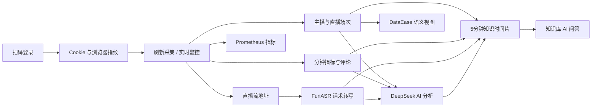

# 抖音直播运营分析系统

面向直播运营团队的一体化中台：使用已扫码登录的采集账号同步主播、直播场次、分钟指标和用户评论；使用受控的 FunASR 队列生成直播话术；调用 DeepSeek 完成话术评分、异常分析和优化建议；最后把直播数据、评论、话术与 AI 报告统一写入知识库进行问答。

> 本项目仅用于已获授权的数据分析。请遵守平台规则、隐私要求和当地法律，不要采集或传播无权处理的数据。

## 核心能力

- **扫码登录**：保存 Cookie、StorageState 和浏览器指纹，后续采集复用登录环境；连续两次探测失败才判定登录过期，减少平台临时跳转误报。
- **刷新数据采集**：增量补齐全部主播、历史直播场次、场次指标、评论、观众画像和流地址。
- **实时直播监控**：定时识别开播状态，直播中持续采集指标和评论，下播后补齐场次详情。
- **可靠任务**：采集与 ASR 任务保存幂等键、Trace ID、Worker、心跳和重试次数，生命周期事件写入可回放的 Redis Streams。
- **话术转写**：采集后自动为真实回放排队，本地 FunASR 默认开启；回放按 5 分钟分片并保存断点，限制单任务并发和 5 个排队任务。
- **视频下载**：场次详情显示 m3u8 地址，可选择本地位置并以原码流低开销封装为 MP4。
- **AI 分析**：话术评分、趋势分析、异常检测、高意向用户识别和运营优化建议。
- **知识库问答**：话术、评论和分钟指标按 5 分钟形成可追溯时间片，混合检索后返回主播、场次、时间范围和原文来源。
- **指标语义层**：统一 10 项核心指标定义，并通过 7 个 `de_v_*` 只读事实/维度视图供 DataEase 使用。
- **可观测性**：全请求 Trace ID、JSON 结构化日志、Prometheus `/metrics` 和低资源 Grafana 可选监控。

## 数据链路



## 技术栈

- 前端：Vue 3、TypeScript、Vite、SoybeanAdmin、Naive UI、ECharts
- 后端：FastAPI、SQLAlchemy、APScheduler、Playwright
- 数据：MySQL 8、Redis 7
- AI：DeepSeek API、FunASR、ffmpeg
- 可视化：DataEase（可选）
- 可观测性：Prometheus、Grafana（可选 profile）

## 环境要求

- macOS 或 Linux
- Docker Desktop
- Python 3.10
- Node.js 20+ 与 pnpm
- ffmpeg

macOS 可检查依赖：

```bash
docker --version
python3 --version
node --version
pnpm --version
ffmpeg -version
```

## 首次安装

1. 创建本地配置，填写自己的 DeepSeek 密钥：

```bash
cp .env.example .env
```

2. 安装后端依赖和 Playwright Chromium：

```bash
cd backend
python3 -m venv .venv
source .venv/bin/activate
pip install -r requirements.txt
playwright install chromium
cd ..
```

3. 安装前端依赖：

```bash
cd frontend
pnpm install
cd ..
```

4. 一键启动：

```bash
./start.sh
```

启动后访问：

- 前端：<http://localhost:9527>
- 后端健康检查：<http://localhost:8000/health>
- API 文档：<http://localhost:8000/docs>
- DataEase（可选）：<http://localhost:8100>
- Prometheus（可选）：<http://localhost:9090>
- Grafana（可选）：<http://localhost:3000>

`start.sh` 启动 MySQL、Redis、执行 Alembic 数据库迁移、配置 DataEase 只读账号、启动后端和前端，后端会自动启动 FunASR。采集调度器由后端统一管理，不再额外启动第二个采集 Worker；FunASR 限制 2 核、1.8GB 内存，ffmpeg 单线程，ASR Worker 单任务并发且最多排队 5 场。

DataEase 应使用 `.env` 中的 `DATAEASE_READER_USER` 和 `DATAEASE_READER_PASSWORD` 连接业务 MySQL。该账号只有 `SELECT`、`SHOW VIEW` 权限，不能修改业务数据。现有大屏继续使用 `de_*` 宽表，新数据集优先使用 `de_v_*` 语义视图；统一指标接口为 `GET /api/v1/dataease/semantic-layer`，同步状态接口为 `GET /api/v1/dataease/status`。

## 推荐操作顺序

第一次使用建议先阅读图文教程：[新手使用教程](docs/beginner-guide.md)。教程包含当前真实页面截图、每一步成功标准和常见故障处理。

1. 打开“数据采集”页面，扫码登录采集账号。
2. 确认账号状态为“已登录”，并使用“检查存活”验证 Cookie。
3. 可直接执行“刷新数据采集”；刷新期间实时监控会保持开启但暂缓浏览器任务，刷新完成后自动恢复。
4. 等待采集进度完成，查看已同步主播数、场次数、详情数和失败原因。
5. 在“直播场次”查看详情、分钟趋势、按用户归组的评论、m3u8 地址和视频下载。
6. ASR 默认自动生成话术；电脑负载较高时，可在采集页关闭 ASR 释放模型内存。
7. 在“知识库”点击“同步最近 20 场”，确认话术、评论和指标时间片数量，再使用问答输入业务问题。

## 前端交互规范

- 业务页面沿用 SoybeanAdmin 的 Vue 3、TypeScript、Pinia、Naive UI、UnoCSS 与 Elegant Router 结构。
- 依赖安装和脚本统一使用 `pnpm`，提交前执行类型检查、ESLint 和生产构建。
- 每个业务页统一展示用途、真实数据状态、前置条件和下一步操作；右上角“新手帮助”会根据当前路由给出操作顺序。
- 列表页区分真实零值与未采集值，长表格使用固定关键列、内部滚动和响应式分页。
- 异步操作必须展示加载、成功结果或可恢复的失败原因，危险操作必须二次确认。
- 数据大屏的主播数量按唯一抖音号去重，避免同一主播修改昵称后被重复计数。

## ASR 安全说明

FunASR 首次启动会下载并加载模型，可能需要数分钟。项目为 8GB 内存电脑设置了容器资源限制、低优先级 Worker、单任务并发和 5 个任务队列上限：

- 自动队列优先处理短场次，正在直播的无限流不会进入离线转写。
- 真实回放默认按 300 秒分片；Worker 重启只重试未完成分片，不删除已经完成的话术。
- 无语音或失效回放失败后不会自动反复重试。
- 页面显示“处理中 0”后再关闭 ASR，关闭会释放模型内存。
- “未识别到有效语音”通常表示回放没有人声、流已过期或音频过短，不会写入模拟话术。
- 缺少真实 m3u8 时任务会明确失败，不会使用模拟流地址兜底。

任务生命周期同时写入 Redis Stream `douyin:task-events`。Redis 短暂不可用不会阻断真实采集，最终任务状态以 MySQL 为准。

手动启停 FunASR（一般直接使用页面开关即可）：

```bash
docker compose --profile funasr up -d funasr
docker stop douyin_live_funasr
```

## 知识库内容

每个场次可幂等同步以下来源：

| 来源 | `source_type` | 内容 |
| --- | --- | --- |
| 直播数据 | `live_data` | 汇总指标、转化率、分钟趋势、观众画像 |
| 互动评论 | `comments` | 评论时间、昵称、内容和高意向标记 |
| 话术 | `transcript` | FunASR 识别后的完整话术 |
| AI 分析 | `ai_analysis` | 评分、异常、趋势和优化建议 |

知识库同步是增量且幂等的：再次同步会更新同一场次内容，不会重复生成直播数据或评论条目。

### 5 分钟时间片

`knowledge_time_slices` 使用直播平台时间把以下真实数据绑定到同一区间：

- FunASR 话术使用相对开播秒数归属。
- 评论必须同时具备评论平台时间和场次开播时间才会归属；无法确定的评论只增加“未映射评论”计数，不猜测时间片。
- 分钟指标使用 `metric_time` 归属，并保留采样数、平均在线、峰值在线及首末值变化。
- 重复同步使用源数据哈希更新原时间片，不重复插入。

主要接口：

```text
GET  /api/v1/knowledge-base/time-slices/status
GET  /api/v1/knowledge-base/time-slices
GET  /api/v1/knowledge-base/time-slices/search?query=...
POST /api/v1/knowledge-base/time-slices/sync/{session_id}
```

## 可观测性

后端按照 Prometheus Python Client 规范提供 `GET /metrics`，每个 HTTP 响应返回 `X-Trace-ID`，也可通过请求头传入合法 `X-Trace-ID` 串联外部调用。JSON 日志包含时间、级别、模块、函数、行号和 Trace ID。

默认一键启动不会启动 Prometheus 和 Grafana。需要查看监控大盘时执行：

```bash
docker compose --profile observability up -d prometheus grafana
```

资源限制为 Prometheus 0.5 核/512MB、Grafana 0.5 核/512MB。Grafana 默认地址为 <http://localhost:3000>，本地初始账号为 `admin / admin123`，首次使用后请立即修改密码。配置参考 [Prometheus Python Client 官方文档](https://prometheus.github.io/client_python/exporting/http/asgi/)、[Grafana Docker 官方文档](https://grafana.com/docs/grafana/latest/setup-grafana/installation/docker/) 和 [DataEase 数据源文档](https://dataease.io/docs/v2/user_manual/datasource_description/)。

## 常用检查

后端测试：

```bash
cd backend
source .venv/bin/activate
pytest -q
```

前端类型和构建检查：

```bash
cd frontend
pnpm typecheck
pnpm lint
pnpm build
```

服务状态：

```bash
curl http://localhost:8000/health
curl http://localhost:8000/metrics
docker compose ps
```

## 目录结构

```text
douyinLive/
├── backend/          FastAPI、采集、ASR、AI 与测试
├── frontend/         SoybeanAdmin 前端
├── data/             本地数据库、模型、日志（不提交 Git）
├── docs/             开发记录
├── observability/    Prometheus 与 Grafana 配置
├── docker-compose.yml
└── start.sh          本地一键启动脚本
```

## 数据安全

- `.env`、`data/`、`backend/storage_state/*.json` 已加入 `.gitignore`。
- Cookie、Token、浏览器指纹和 AI 密钥只能保存在本机，不得提交远程仓库。
- 默认 `ALLOW_SYNTHETIC_DATA=false`。模拟监控和模拟 ASR 必须同时开启调试模式、总开关和具体功能开关，防止误写真实数据库。
- 删除采集账号会清除本地登录环境，需要重新扫码，请确认后操作。
- 正式部署前必须替换 `JWT_SECRET_KEY` 和数据库默认密码。
- 首次启动前请修改 `DATAEASE_READER_PASSWORD`，DataEase 数据源不要使用 root 账号。

## 常见问题

### 页面显示 500

先打开 <http://localhost:8000/health>。如果不是 `status: ok`，检查 Docker Desktop、MySQL 和后端终端日志。

### 浏览器被关闭或 `Target page ... has been closed`

系统允许实时监控与刷新数据采集同时保持开启：刷新任务会暂时接管浏览器，监控不再重复创建页面，刷新结束后自动恢复。如果仍出现该错误，先查看采集日志中的 Trace ID 和任务心跳；系统会自动重建失效上下文并重试一次。

### 电脑明显卡顿

先在采集页面关闭 ASR，并停止实时监控。确认没有重复 Worker：

```bash
pgrep -af 'workers.scraper_worker|workers.asr_worker'
```

正常情况下，默认一键启动不会出现独立 `scraper_worker`，但会有且仅有 1 个 `asr_worker`；在页面关闭 ASR 后不应存在 `asr_worker`。

### 评论对应错场次

评论以平台真实 `roomId` 绑定场次，并受直播起止时间保护。不要用主播昵称推断归属；如发现旧数据异常，重新执行刷新采集以补齐映射。
