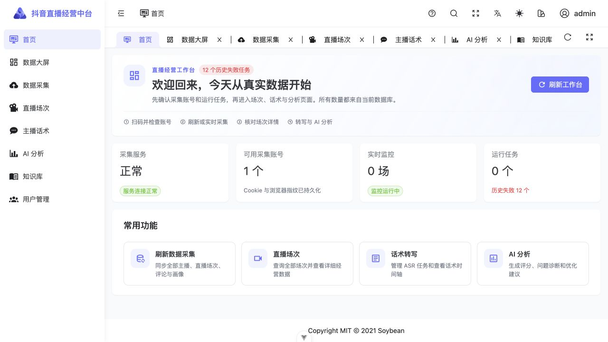
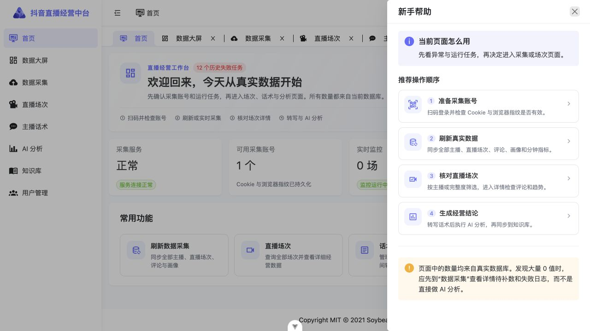
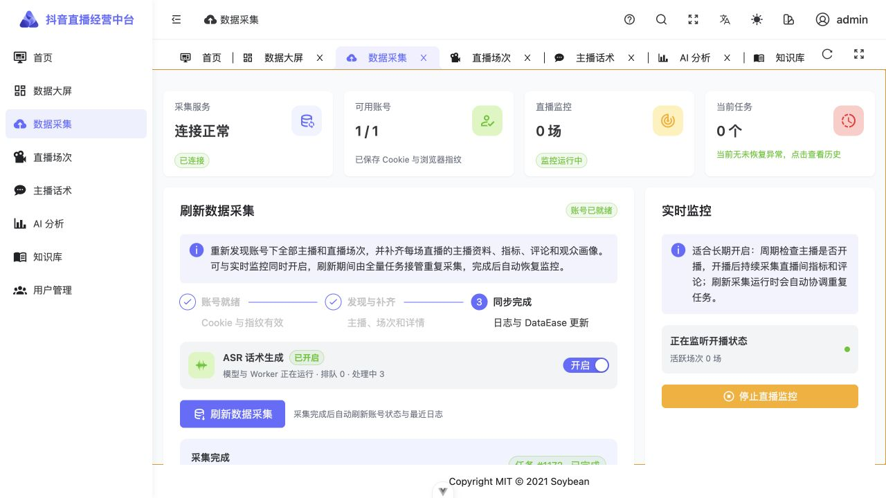
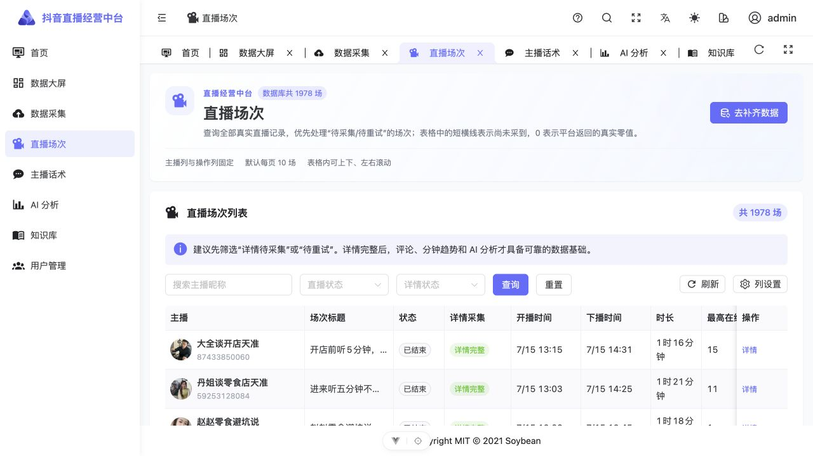
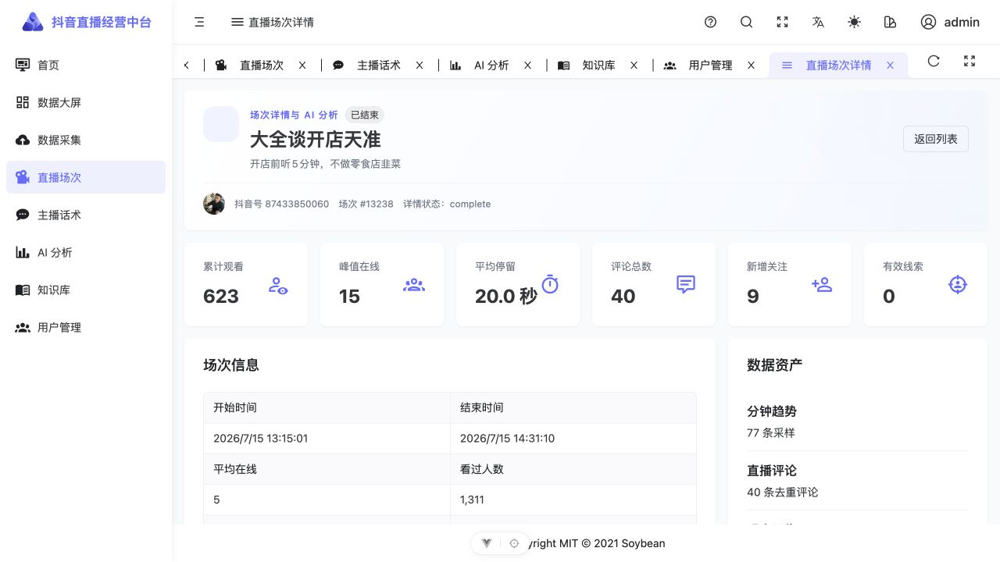
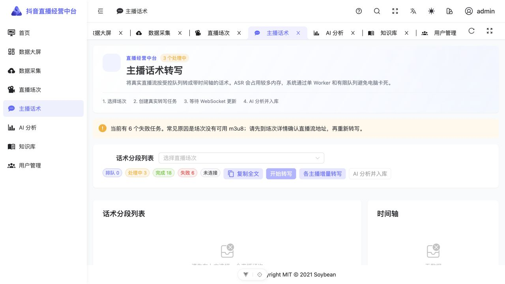
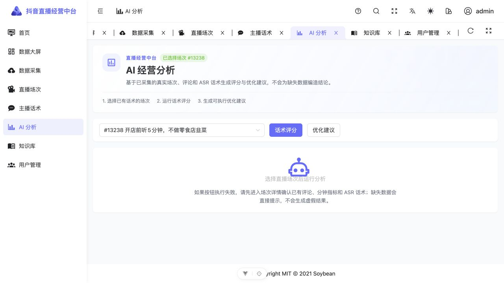
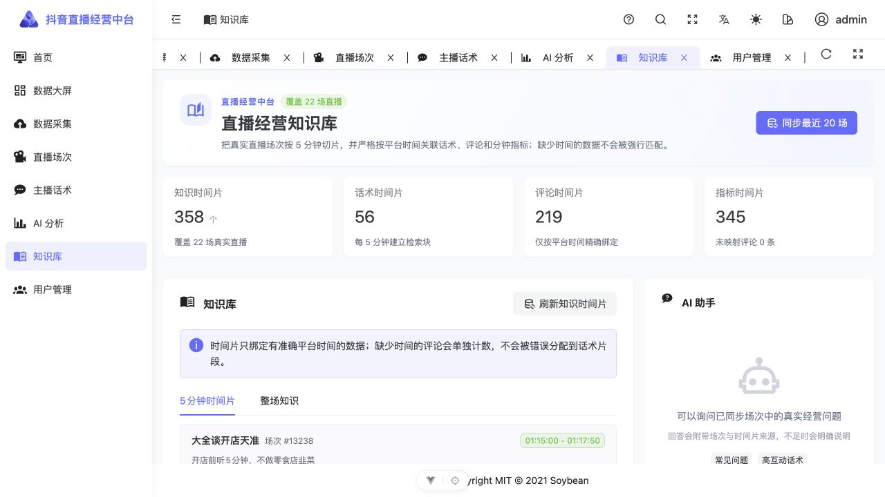
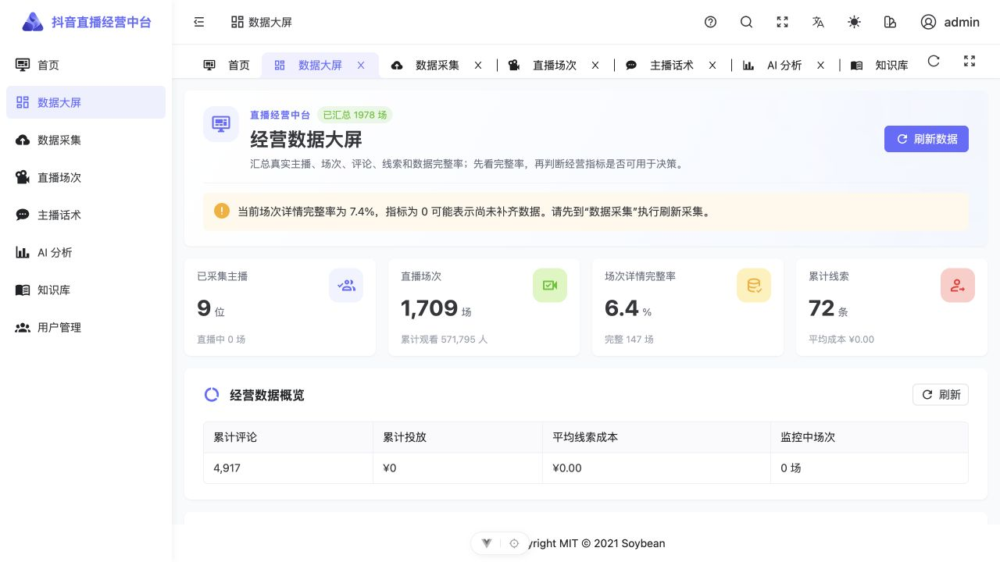
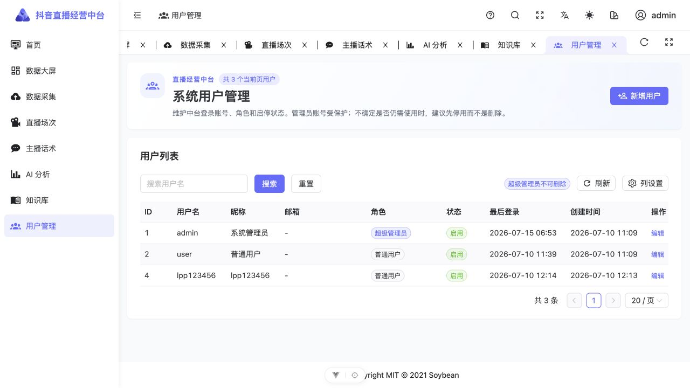

# 抖音直播经营中台新手使用教程

本教程适合第一次使用本项目的同学。页面中的主播数、场次数、评论和任务状态都来自当前真实数据库，因此截图里的数量会随着后续采集变化。

> 数据安全：只采集已获授权的账号和直播数据。Cookie、浏览器指纹、Token、AI 密钥只保存在本机，不应上传到远程仓库。

## 1. 登录后先看首页

启动项目后打开 <http://localhost:9527>，使用管理员提供的中台账号登录。首页会汇总采集服务、可用账号、实时监控和任务状态。

首次进入时，先检查下面 4 项：

1. “采集服务”应显示 **正常**。
2. “可用采集账号”至少为 **1 个**。
3. “运行任务”可以为 0，表示当前没有采集任务执行。
4. 如果出现历史失败任务，点击对应卡片进入采集页查看日志，不代表当前服务一定故障。

页面右上角问号按钮会打开“新手帮助”。每个页面都会根据当前位置显示不同的操作提示。

## 2. 准备采集账号

点击左侧 **数据采集**。首次使用需要扫码登录；已经保存账号时，先点击“管理采集账号”，在账号列表中点击“检查存活”。

检查成功后，应看到：

1. 可用账号显示 `1 / 1` 或其他非零数量。
2. 账号状态为“已登录”。
3. 页面提示已保存 Cookie 与浏览器指纹。

如果检查失败，请点击“重新扫码”。扫码成功后系统会保存 Cookie、StorageState 和浏览器指纹，后续采集会复用同一登录环境。

> 删除采集账号会同时清除本地登录环境，需要重新扫码。删除前页面会二次确认。

## 3. 选择采集方式

数据采集页有两种真实采集方式，可以同时保持开启，系统会协调浏览器上下文和重复任务。

### 刷新数据采集

适合首次采集或补齐历史数据。点击 **刷新数据采集** 后，系统会：

1. 重新发现账号下的全部主播。
2. 同步每位主播的全部直播场次。
3. 分批补齐主播资料、分钟指标、评论、观众画像和 m3u8 地址。
4. 显示已采集主播、已发现场次、已补齐详情、失败数和剩余待补数。
5. 完成后刷新日志，并把可分析数据同步到 DataEase 宽表。

场次较多时一次任务只补一批详情是正常现象。再次点击“刷新数据采集”会继续补剩余场次，不会重复写入同一份数据。

### 实时监控

适合日常长期运行。启动后系统会周期检查主播是否开播；发现开播后持续采集直播间分钟指标和评论，下播后补齐场次详情。

“活跃场次 0 场”只表示当前没有检测到直播中的场次，不表示监控故障。应结合“正在监听开播状态”和最近错误一起判断。

### ASR 话术生成

ASR 默认开启，采集到可用直播流后会自动排队转写。为避免电脑卡死，项目限制为单 Worker、单任务并发和最多 5 个排队任务。

电脑明显卡顿时，可以先关闭 ASR。关闭只停止后续转写，不会删除已采集场次、评论或已生成话术。

## 4. 查看和筛选直播场次

点击左侧 **直播场次**。建议优先用“详情状态”筛选待采集或待重试的记录。

列表阅读规则：

1. **0**：平台或已完成详情采集返回的真实零值。
2. **-**：该字段尚未采到，不能当作 0 使用。
3. **详情完整**：本场已完成详情采集，可以查看评论、趋势和 AI 分析。
4. **待采集/待重试**：返回采集页继续刷新数据。
5. **平台不可回放**：企业后台当前无法再返回该场详情，不应伪造补值。

主播列和操作列已固定，默认每页 10 场。表格区域可以上下、左右滚动，不会带动整个页面横向移动。

## 5. 查看单场详情和下载视频

点击列表右侧 **详情**，会进入隐藏的场次详情页。详情页把基础指标、分钟趋势、按用户归组的评论、观众画像、直播流和 AI 分析放在同一页签区域。

核对重点：

1. 主播昵称、头像、抖音号和场次编号是否一致。
2. 开始时间、结束时间、评论数和分钟采样数是否合理。
3. 评论页签中的评论是否属于当前主播和当前场次。
4. “直播回放与下载”是否显示 m3u8 地址。

存在 m3u8 时，可点击“复制地址”或“选择位置并下载 MP4”。下载过程只做原码流封装，不重新编码；直播仍进行中时应等下播后再下载完整视频。

## 6. 生成主播话术

点击左侧 **主播话术**，先选择一个已经保存 m3u8 的直播场次。

操作顺序：

1. 在下拉框选择“主播 · 开播时间 · 时长 · 场次编号”。
2. 点击“开始转写”创建单场任务，或点击“各主播增量转写”让系统为各主播补一场。
3. 等待状态从“排队/处理中”变成“完成”。
4. 转写过程中 WebSocket 会自动接收新增话术片段。
5. 完成后可复制全文，或点击“AI 分析并入库”。

如果提示没有可用直播流，请返回场次详情确认 m3u8，不要反复创建同一个失败任务。

## 7. 使用 AI 分析

点击左侧 **AI 分析**，选择已有真实话术的场次，再执行话术评分或优化建议。

AI 分析不会为缺失数据编造结论。如果场次缺少话术、评论或分钟指标，页面会提示先补齐数据。生成结果后仍应回到场次详情核对引用的原始数据。

## 8. 同步并使用知识库

点击左侧 **知识库**，先点击“同步最近 20 场”。系统会将话术、评论和分钟指标按真实平台时间组成 5 分钟时间片。

知识库遵循以下规则：

1. 评论必须有平台时间且落在场次起止时间内才会绑定到时间片。
2. 无法确定时间的评论只计入“未映射评论”，不会猜测归属。
3. AI 回答会显示来源场次和时间片；没有足够证据时会明确说明。
4. 重复同步是幂等更新，不会重复插入同一场知识。

可以先点击“常见问题”或“高互动话术”示例，再根据实际经营问题修改提问。

## 9. 查看大屏与维护用户

**数据大屏**汇总主播、场次、评论、线索和详情完整率。详情完整率较低时，应先补数据，再解释大量 0 值。

DataEase 地址未配置时，页面会明确显示配置提示，不影响上方真实汇总数据。完成配置后，DataEase 通过只读账号访问 `de_v_*` 语义视图和 `de_*` 宽表。

**用户管理**只对超级管理员开放。新增用户时填写用户名、密码、角色和状态；不确定是否还需使用的账号，优先设为“禁用”。

## 10. 常见问题

### 页面显示 500

先访问 <http://localhost:8000/health>。健康检查正常时刷新页面；仍失败则到数据采集日志查看错误消息和 Trace ID。

### 采集日志出现 BrowserContext 已关闭

先看任务是否已被手动停止。系统会自动恢复浏览器上下文并重试一次；如果连续失败，再检查账号存活或重新扫码。

### 实际有主播开播，但活跃场次为 0

确认实时监控显示“正在监听开播状态”，再查看最近错误和账号存活。平台开播状态可能有短暂延迟，可等待下一次轮询，不要频繁重启浏览器。

### 页面很多数据为 0

先看场次详情状态。详情完整时 0 是真实零值；详情未完成时应显示短横线。到数据采集页继续刷新，直到“剩余待补”下降。

### 电脑卡顿

先关闭 ASR，等待“处理中”任务结束；仍卡顿时再停止实时监控。不要同时启动多个后端、采集 Worker 或 ASR Worker。

## 11. 每次使用后的检查清单

- [ ] 采集账号检查存活成功。
- [ ] 刷新采集或实时监控至少有一种处于预期状态。
- [ ] 采集任务进度结束，失败数和剩余待补数已核对。
- [ ] 直播场次的主播、时间、评论和分钟趋势对应正确。
- [ ] ASR 任务没有超出电脑承受范围。
- [ ] AI 分析引用的是已有真实话术和评论。
- [ ] 知识库已同步，并能看到可追溯来源。
